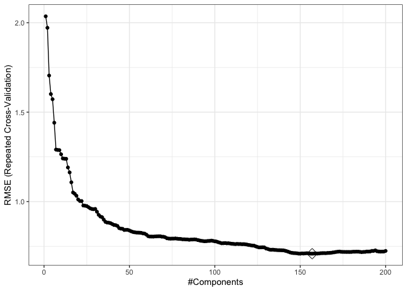

Data Science 2,Hw1
================
Ekta Chaudhary
24/02/2020

``` r
library(tidyverse)
library(caret)
library(ModelMetrics)
library(glmnet)
```

# Reading the Datasets

``` r
train_data = read_csv(file = "./data/solubility_train.csv")
test_data = read_csv(file = "./data/solubility_test.csv")
```

We will predict solubility of compounds using their chemical
structures.The training data are in the file “solubilitytrain.csv” and
the test data are in “solubil-itytest.csv”. Among the 228 predictors,
208 are binary variables that indicate the presenceor absence of a
particular chemical substructure, 16 are count features, such as the
numberof bonds or the number of bromine atoms, and 4 are continuous
features, such as molecularweight or surface area. The response is in
the column
“Solubility”.

# 1\) Fit a linear model using least squares on the training data and calculate the mean square error using the test data.

``` r
fit_lm <- lm(Solubility~., data = train_data)
pred_lm <- predict(fit_lm, test_data)
mse(test_data$Solubility, pred_lm)
```

    ## [1] 0.5558898

The mean square error is
0.5558898.

# 2\) Fit a ridge regression model on the training data, withλchosen by cross-validation.Report the test error.

``` r
x_train = model.matrix(Solubility ~ ., train_data)[,-1]
y_train = train_data$Solubility
x_test = model.matrix(Solubility ~ ., test_data)[,-1]
y_test = test_data$Solubility

# Validation control
ctrl1 <- trainControl(method = "repeatedcv", number = 10, repeats = 5)
```

``` r
set.seed(2)
ridge.fit <- train(x_train, y_train,
                   method = "glmnet",
                   tuneGrid = expand.grid(alpha = 0, 
                                          lambda = exp(seq(-10, 10, length = 200))),
                   # preProc = c("center", "scale"),
                   trControl = ctrl1)

plot(ridge.fit, xTrans = function(x) log(x))
```

<!-- -->

``` r
ridge.fit$bestTune
```

    ##    alpha    lambda
    ## 80     0 0.1274155

``` r
best_lambda <- ridge.fit$bestTune$lambda
best_lambda
```

    ## [1] 0.1274155

``` r
ridge.pred = predict(ridge.fit$finalModel, s = best_lambda, newx = x_test) 
#Using best lambda to predict test data
mean((ridge.pred - y_test)^2)
```

    ## [1] 0.5134603

# Fit a lasso model on the training data, withλchosen by cross-validation. Report thetest error, along with the number of non-zero coefficient estimates.

``` r
set.seed(2)
lasso.fit <- train(x_train, y_train,
                   method = "glmnet",
                   tuneGrid = expand.grid(alpha = 1, 
                                          lambda = exp(seq(-10, 10, length = 200))),
                   # preProc = c("center", "scale"),
                   trControl = ctrl1)

plot(lasso.fit, xTrans = function(x) log(x))
```

<!-- -->

``` r
best_lambda_lasso <- lasso.fit$bestTune$lambda
best_lambda_lasso
```

    ## [1] 0.0046222

``` r
lasso.pred = predict(lasso.fit$finalModel, s = best_lambda_lasso, newx = x_test) 
#Using best lambda to predict test data
mean((lasso.pred - y_test)^2)
```

    ## [1] 0.4987333

# PCR

``` r
set.seed(2)
pcr.fit <- train(x_train, y_train,
                  method = "pcr",
                  tuneLength = 200,
                  trControl = ctrl1,
                  scale = TRUE)

predy.pcr <- predict(pcr.fit$finalModel, newdata = x_test, 
                       ncomp = pcr.fit$bestTune$ncomp)
mse(y_test, predy.pcr)
```

    ## [1] 0.549917

``` r
ggplot(pcr.fit, highlight = TRUE) + theme_bw()
```

<!-- -->
