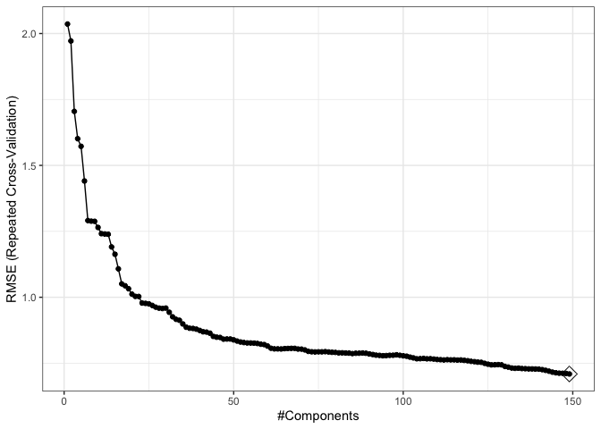
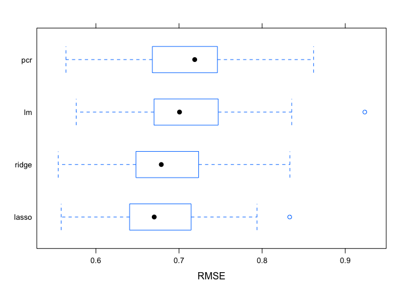

Data Science 2,Hw1
================
Ekta Chaudhary
24/02/2020

``` r
library(tidyverse)
library(caret)
library(ModelMetrics)
library(glmnet)
```

# Reading the Datasets

``` r
train_data = read_csv(file = "./data/solubility_train.csv")
test_data = read_csv(file = "./data/solubility_test.csv")
```

We will predict solubility of compounds using their chemical
structures.The training data are in the file “solubilitytrain.csv” and
the test data are in “solubil-itytest.csv”. Among the 228 predictors,
208 are binary variables that indicate the presenceor absence of a
particular chemical substructure, 16 are count features, such as the
numberof bonds or the number of bromine atoms, and 4 are continuous
features, such as molecularweight or surface area. The response is in
the column “Solubility”.

``` r
#Training data
x_train = model.matrix(Solubility ~ ., train_data)[,-1]
y_train = train_data$Solubility
#Tese data
x_test = model.matrix(Solubility ~ ., test_data)[,-1]
y_test = test_data$Solubility

# Validation control
ctrl1 <- trainControl(method = "repeatedcv", number = 10, repeats = 5)
```

# a) Fit a linear model using least squares on the training data and calculate the mean square error using the test data.

``` r
set.seed(2)
lm.fit <- train(x_train, y_train,
                method = "lm",
                trControl = ctrl1)
pred.lm <- predict(lm.fit$finalModel, newdata = data.frame(x_test))
mean((pred.lm - y_test)^2)
```

    ## [1] 0.5558898

The test mean square error is
0.5558898.

# b) Fit a ridge regression model on the training data, with λ chosen by cross-validation.Report the test error.

``` r
set.seed(2)
ridge.fit <- train(x_train, y_train,
                   method = "glmnet",
                   tuneGrid = expand.grid(alpha = 0, 
                                          lambda = exp(seq(-10, 10, length = 200))),
                   trControl = ctrl1)

plot(ridge.fit, xTrans = function(x) log(x))
```

<!-- -->

``` r
ridge.fit$bestTune
```

    ##    alpha    lambda
    ## 80     0 0.1274155

``` r
best_lambda <- ridge.fit$bestTune$lambda
best_lambda
```

    ## [1] 0.1274155

``` r
ridge.pred = predict(ridge.fit$finalModel, s = best_lambda, newx = x_test) 
#Using best lambda to predict test data
mean((ridge.pred - y_test)^2)
```

    ## [1] 0.5134603

The test error is
0.5134603.

# c) Fit a lasso model on the training data, with λ chosen by cross-validation. Report the test error, along with the number of non-zero coefficient estimates.

``` r
set.seed(2)
lasso.fit <- train(x_train, y_train,
                   method = "glmnet",
                   tuneGrid = expand.grid(alpha = 1, 
                                          lambda = exp(seq(-10, 10, length = 200))),
                   # preProc = c("center", "scale"),
                   trControl = ctrl1)

plot(lasso.fit, xTrans = function(x) log(x))
```

<!-- -->

``` r
best_lambda_lasso <- lasso.fit$bestTune$lambda
best_lambda_lasso
```

    ## [1] 0.0046222

``` r
lasso.pred = predict(lasso.fit$finalModel, s = best_lambda_lasso, newx = x_test) 
#Using best lambda to predict test data
mean((lasso.pred - y_test)^2)
```

    ## [1] 0.4987333

The test error is 0.4987

``` r
lasso.coef <- coef(lasso.fit$finalModel,lasso.fit$bestTune$lambda)
length(lasso.coef)
```

    ## [1] 229

``` r
length(lasso.coef[lasso.coef != 0])
```

    ## [1] 144

There are 144 non-zero coefficient
estimates.

# d) Fit a principle component regression model on the training data, with M chosen by cross-validation. Report the test error, along with the value of M selected by cross-validation.

``` r
set.seed(2)
pcr.fit <- train(x_train, y_train,
                  method = "pcr",
                  tuneLength = 150,
                  trControl = ctrl1,
                  scale = TRUE)

predy.pcr <- predict(pcr.fit$finalModel, newdata = x_test, 
                       ncomp = pcr.fit$bestTune$ncomp)
mean((predy.pcr - y_test)^2)
```

    ## [1] 0.5483713

``` r
ggplot(pcr.fit, highlight = TRUE) + theme_bw()
```

<!-- -->
The test error is
0.5483713.

# e) Briefly discuss the results obtained in (a)∼(d).

``` r
resamp <- resamples(list(lasso = lasso.fit, ridge = ridge.fit, pcr = pcr.fit, lm = lm.fit))
summary(resamp)
```

    ## 
    ## Call:
    ## summary.resamples(object = resamp)
    ## 
    ## Models: lasso, ridge, pcr, lm 
    ## Number of resamples: 50 
    ## 
    ## MAE 
    ##            Min.   1st Qu.    Median      Mean   3rd Qu.      Max. NA's
    ## lasso 0.4252298 0.4840513 0.5177887 0.5173336 0.5484913 0.6385859    0
    ## ridge 0.4236514 0.4901614 0.5218728 0.5213242 0.5473545 0.6319687    0
    ## pcr   0.4288747 0.5071586 0.5462737 0.5419025 0.5818077 0.6600831    0
    ## lm    0.4151018 0.5042577 0.5288620 0.5304540 0.5607729 0.6838928    0
    ## 
    ## RMSE 
    ##            Min.   1st Qu.    Median      Mean   3rd Qu.      Max. NA's
    ## lasso 0.5582277 0.6414335 0.6701683 0.6775176 0.7145061 0.8331316    0
    ## ridge 0.5547163 0.6488957 0.6786781 0.6856755 0.7234002 0.8333606    0
    ## pcr   0.5648038 0.6758325 0.7190553 0.7088013 0.7451357 0.8632726    0
    ## lm    0.5763256 0.6702141 0.7006166 0.7093576 0.7470323 0.9234601    0
    ## 
    ## Rsquared 
    ##            Min.   1st Qu.    Median      Mean   3rd Qu.      Max. NA's
    ## lasso 0.8372380 0.8774330 0.8947011 0.8904805 0.9047275 0.9283355    0
    ## ridge 0.8326964 0.8764872 0.8908486 0.8880644 0.9001630 0.9264558    0
    ## pcr   0.8190896 0.8664793 0.8838414 0.8807491 0.8948763 0.9293462    0
    ## lm    0.8105782 0.8668429 0.8844072 0.8814378 0.8966132 0.9313096    0

``` r
bwplot(resamp, metric = "RMSE")
```

<!-- --> As
we can see from the graph, the minimum RMSE is for Lasso followed by
Ridge and Linear model. The PCR has the maximum RMSE.

# f) Which model will you choose for predicting solubility?

Since, the RMSE is the lowest for Lasso, we should choose the Lasso
model to predict solubility.
