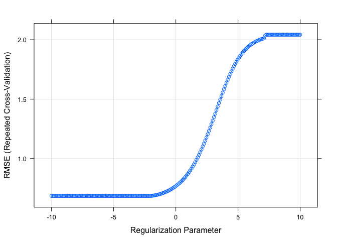
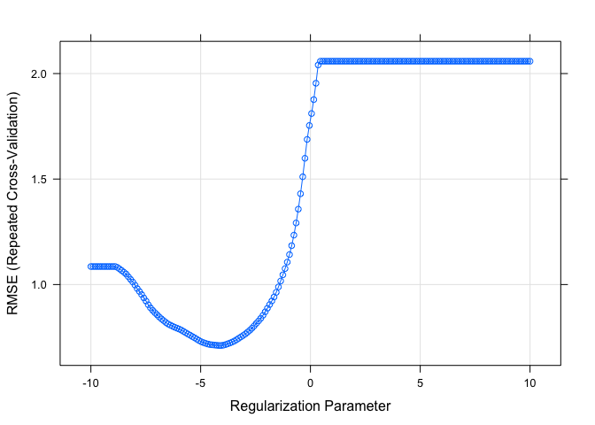

Data Science 2,Hw1
================
Ekta Chaudhary
24/02/2020

``` r
library(tidyverse)
library(caret)
library(ModelMetrics)
library(glmnet)
```

# Reading the Datasets

``` r
train_data = read_csv(file = "./data/solubility_train.csv")
test_data = read_csv(file = "./data/solubility_test.csv")
```

We will predict solubility of compounds using their chemical
structures.The training data are in the file “solubilitytrain.csv” and
the test data are in “solubil-itytest.csv”. Among the 228 predictors,
208 are binary variables that indicate the presenceor absence of a
particular chemical substructure, 16 are count features, such as the
numberof bonds or the number of bromine atoms, and 4 are continuous
features, such as molecularweight or surface area. The response is in
the column “Solubility”.

# Linear Model

``` r
fit_lm <- lm(Solubility~., data = train_data)
pred_lm <- predict(fit_lm, test_data)
mse(test_data$Solubility, pred_lm)
```

    ## [1] 0.5558898

# Ridge Regression

``` r
x <- model.matrix(Solubility~.,test_data)[,-1]
# vector of response
y <- test_data$Solubility
ridge.mod <- glmnet(x,y, standardize = TRUE,
                    alpha = 0, 
                    lambda = exp(seq(-1, 10, length = 100)))
```

``` r
ctrl1 <- trainControl(method = "repeatedcv", number = 10, repeats = 5)

set.seed(2)
ridge.fit <- train(x, y,
                   method = "glmnet",
                   tuneGrid = expand.grid(alpha = 0, 
                                          lambda = exp(seq(-10, 10, length = 200))),
                   # preProc = c("center", "scale"),
                   trControl = ctrl1)

plot(ridge.fit, xTrans = function(x) log(x))
```

<!-- -->

``` r
ridge.fit$bestTune
```

    ##    alpha    lambda
    ## 80     0 0.1274155

``` r
best_lambda <- ridge.fit$bestTune$lambda
best_lambda
```

    ## [1] 0.1274155

\#Lasso

``` r
set.seed(2)
lasso.fit <- train(x, y,
                   method = "glmnet",
                   tuneGrid = expand.grid(alpha = 1, 
                                          lambda = exp(seq(-10, 10, length = 200))),
                   # preProc = c("center", "scale"),
                   trControl = ctrl1)

plot(lasso.fit, xTrans = function(x) log(x))
```

<!-- -->

``` r
lasso.fit$bestTune
```

    ##    alpha     lambda
    ## 60     1 0.01707138

``` r
best_lambda_lasso <- lasso.fit$bestTune$lambda
best_lambda_lasso
```

    ## [1] 0.01707138
