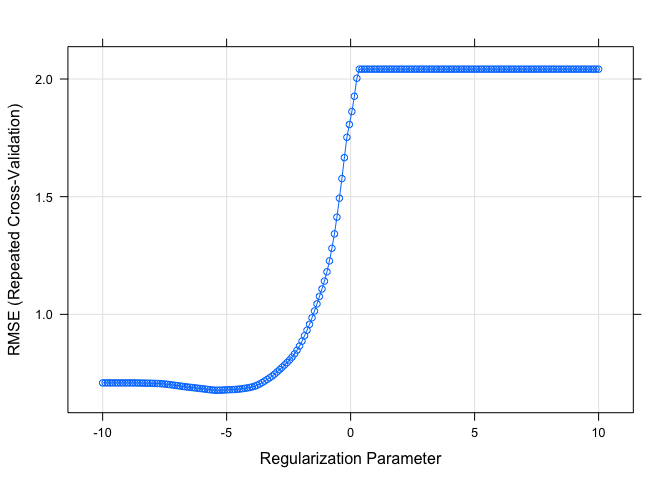

Data Science 2,Hw1
================
Ekta Chaudhary
24/02/2020

``` r
library(tidyverse)
library(caret)
library(ModelMetrics)
library(glmnet)
```

# Reading the Datasets

``` r
train_data = read_csv(file = "./data/solubility_train.csv")
test_data = read_csv(file = "./data/solubility_test.csv")
```

We will predict solubility of compounds using their chemical
structures.The training data are in the file “solubilitytrain.csv” and
the test data are in “solubil-itytest.csv”. Among the 228 predictors,
208 are binary variables that indicate the presenceor absence of a
particular chemical substructure, 16 are count features, such as the
numberof bonds or the number of bromine atoms, and 4 are continuous
features, such as molecularweight or surface area. The response is in
the column “Solubility”.

# Linear Model

``` r
fit_lm <- lm(Solubility~., data = train_data)
pred_lm <- predict(fit_lm, test_data)
mse(test_data$Solubility, pred_lm)
```

    ## [1] 0.5558898

``` r
x <- model.matrix(Solubility~.,test_data)[,-1]
# vector of response
y <- test_data$Solubility
ridge.mod <- glmnet(x,y, standardize = TRUE,
                    alpha = 0, 
                    lambda = exp(seq(-1, 10, length = 100)))
```

``` r
ctrl1 <- trainControl(method = "repeatedcv", number = 10, repeats = 5)

set.seed(2)
ridge.fit <- train(x, y,
                   method = "glmnet",
                   tuneGrid = expand.grid(alpha = 0, 
                                          lambda = exp(seq(-1, 10, length = 100))),
                   # preProc = c("center", "scale"),
                   trControl = ctrl1)

plot(ridge.fit, xTrans = function(x) log(x))
```

<!-- -->

``` r
ridge.fit$bestTune
```

    ##   alpha    lambda
    ## 1     0 0.3678794

``` r
coef(ridge.fit$finalModel,ridge.fit$bestTune$lambda)
```

    ## 229 x 1 sparse Matrix of class "dgCMatrix"
    ##                              1
    ## (Intercept)        5.955380038
    ## FP001              0.085454387
    ## FP002             -0.038568304
    ## FP003             -0.128744191
    ## FP004              0.028653287
    ## FP005             -0.080030541
    ## FP006              0.067757749
    ## FP007              0.019152212
    ## FP008             -0.038340445
    ## FP009             -0.003768370
    ## FP010              0.127869347
    ## FP011              0.056662219
    ## FP012             -0.069702137
    ## FP013             -0.073854526
    ## FP014             -0.103879672
    ## FP015              0.088892531
    ## FP016             -0.064321344
    ## FP017             -0.300670030
    ## FP018             -0.063975489
    ## FP019             -0.142581297
    ## FP020             -0.030603160
    ## FP021             -0.162620556
    ## FP022              0.173543680
    ## FP023              0.329374282
    ## FP024              0.178980523
    ## FP025             -0.046097124
    ## FP026              0.151691155
    ## FP027              0.056936774
    ## FP028              0.163073769
    ## FP029              0.064041917
    ## FP030              0.171609618
    ## FP031              0.236110173
    ## FP032              0.059355188
    ## FP033              0.110060098
    ## FP034             -0.109155297
    ## FP035              0.015670350
    ## FP036             -0.363983665
    ## FP037              0.049175452
    ## FP038              0.032361258
    ## FP039             -0.252284140
    ## FP040              0.108589118
    ## FP041             -0.121867303
    ## FP042              0.055943389
    ## FP043              0.368393737
    ## FP044             -0.628593860
    ## FP045              0.179495269
    ## FP046              0.070430313
    ## FP047             -0.058188713
    ## FP048             -0.118550212
    ## FP049              0.367648551
    ## FP050             -0.076917703
    ## FP051             -0.111322872
    ## FP052              0.047754379
    ## FP053             -0.204045605
    ## FP054             -0.363098205
    ## FP055              0.049932287
    ## FP056             -0.252541200
    ## FP057             -0.148465155
    ## FP058              0.171006945
    ## FP059             -0.429413599
    ## FP060             -0.035370462
    ## FP061             -0.069467247
    ## FP062              0.080106719
    ## FP063              0.181851747
    ## FP064              0.099459368
    ## FP065             -0.092650579
    ## FP066              0.030516370
    ## FP067              0.254662249
    ## FP068             -0.027781466
    ## FP069              0.034910254
    ## FP070             -0.303168884
    ## FP071             -0.034980763
    ## FP072              0.220455619
    ## FP073              0.119584996
    ## FP074              0.171719663
    ## FP075              0.050244374
    ## FP076             -0.126812250
    ## FP077              0.008403693
    ## FP078              0.136316690
    ## FP079              0.024136291
    ## FP080              0.116070796
    ## FP081             -0.102967731
    ## FP082             -0.004412965
    ## FP083             -0.189338627
    ## FP084              0.131085661
    ## FP085             -0.084513775
    ## FP086             -0.078373359
    ## FP087             -0.077622404
    ## FP088              0.168370113
    ## FP089             -0.170378179
    ## FP090              0.072848758
    ## FP091              0.079492299
    ## FP092              0.034232637
    ## FP093             -0.003974218
    ## FP094             -0.033775963
    ## FP095              0.028124365
    ## FP096              0.254275221
    ## FP097             -0.028360013
    ## FP098              0.033993373
    ## FP099              0.042772842
    ## FP100             -0.017592028
    ## FP101              0.262849182
    ## FP102              0.091706847
    ## FP103             -0.002669112
    ## FP104             -0.341235693
    ## FP105             -0.024665970
    ## FP106             -0.302156436
    ## FP107             -0.011522705
    ## FP108              0.003511535
    ## FP109             -0.197779892
    ## FP110             -0.062327180
    ## FP111             -0.173756325
    ## FP112             -0.097025425
    ## FP113              0.113131477
    ## FP114              0.069528346
    ## FP115              0.067059568
    ## FP116              0.075226228
    ## FP117              0.073859753
    ## FP118             -0.024853044
    ## FP119             -0.097528611
    ## FP120              0.079251007
    ## FP121              0.053149647
    ## FP122              0.098896753
    ## FP123              0.011837639
    ## FP124              0.143665746
    ## FP125              0.145984160
    ## FP126             -0.168347161
    ## FP127             -0.140583683
    ## FP128             -0.083608326
    ## FP129              0.044916008
    ## FP130              0.091134787
    ## FP131              0.341129131
    ## FP132              0.010882301
    ## FP133             -0.033823268
    ## FP134             -0.210869630
    ## FP135              0.066023342
    ## FP136              0.115141329
    ## FP137              0.038922591
    ## FP138             -0.183975009
    ## FP139              0.255838386
    ## FP140              0.095542269
    ## FP141             -0.051741192
    ## FP142              0.386563081
    ## FP143             -0.126710915
    ## FP144              0.143494416
    ## FP145              0.022405000
    ## FP146             -0.060222077
    ## FP147              0.060713748
    ## FP148             -0.138841475
    ## FP149             -0.139294890
    ## FP150              0.172856803
    ## FP151              0.292799437
    ## FP152             -0.154977042
    ## FP153             -0.063389882
    ## FP154             -0.728946263
    ## FP155             -0.192121694
    ## FP156             -0.114557128
    ## FP157             -0.079878503
    ## FP158             -0.189777685
    ## FP159              0.330944560
    ## FP160              0.102160530
    ## FP161             -0.072283054
    ## FP162              0.119567756
    ## FP163              0.197286466
    ## FP164             -0.021519934
    ## FP165             -0.059226727
    ## FP166              0.058560900
    ## FP167             -0.065702876
    ## FP168             -0.017304619
    ## FP169             -0.066638111
    ## FP170              0.292218430
    ## FP171              0.044277203
    ## FP172             -0.229191155
    ## FP173              0.111056661
    ## FP174              0.260011163
    ## FP175             -0.022759589
    ## FP176             -0.075501401
    ## FP177             -0.211011177
    ## FP178             -0.098588758
    ## FP179              0.282443267
    ## FP180             -0.058926698
    ## FP181              0.113103992
    ## FP182              0.031030153
    ## FP183             -0.007526674
    ## FP184              0.024797820
    ## FP185             -0.239763619
    ## FP186             -0.085006897
    ## FP187             -0.010593098
    ## FP188              0.046289863
    ## FP189              0.209664102
    ## FP190              0.088462029
    ## FP191             -0.067445689
    ## FP192             -0.153215030
    ## FP193             -0.011429451
    ## FP194             -0.064059755
    ## FP195              0.059340093
    ## FP196             -0.099430635
    ## FP197             -0.149936447
    ## FP198             -0.108340960
    ## FP199             -0.158590908
    ## FP200             -0.359845380
    ## FP201              0.724119108
    ## FP202              0.075243976
    ## FP203              0.167296835
    ## FP204              0.019286380
    ## FP205              0.268050469
    ## FP206             -0.259796389
    ## FP207             -0.013018944
    ## FP208              0.166610867
    ## MolWeight         -0.929743015
    ## NumAtoms          -0.316599630
    ## NumNonHAtoms      -0.493298651
    ## NumBonds          -0.284669857
    ## NumNonHBonds      -0.243847060
    ## NumMultBonds      -0.070662119
    ## NumRotBonds       -0.082483360
    ## NumDblBonds        0.046994636
    ## NumAromaticBonds  -0.077964745
    ## NumHydrogen        0.037976600
    ## NumCarbon         -0.184725306
    ## NumNitrogen        0.303016904
    ## NumOxygen          0.140369634
    ## NumSulfer         -0.519108579
    ## NumChlorine       -0.440885558
    ## NumHalogen        -0.207306207
    ## NumRings          -0.213674005
    ## HydrophilicFactor  0.133911983
    ## SurfaceArea1       0.051522411
    ## SurfaceArea2       0.037989639

``` r
set.seed(2)
lasso.fit <- train(x, y,
                   method = "glmnet",
                   tuneGrid = expand.grid(alpha = 1, 
                                          lambda = exp(seq(-1, 5, length = 100))),
                   # preProc = c("center", "scale"),
                   trControl = ctrl1)
plot(lasso.fit, xTrans = function(x) log(x))
```

<!-- -->

``` r
lasso.fit$bestTune
```

    ##   alpha    lambda
    ## 1     1 0.3678794

``` r
coef(lasso.fit$finalModel,lasso.fit$bestTune$lambda)
```

    ## 229 x 1 sparse Matrix of class "dgCMatrix"
    ##                             1
    ## (Intercept)        8.52542790
    ## FP001              .         
    ## FP002              .         
    ## FP003              .         
    ## FP004              .         
    ## FP005              .         
    ## FP006              .         
    ## FP007              .         
    ## FP008              .         
    ## FP009              .         
    ## FP010              .         
    ## FP011              .         
    ## FP012              .         
    ## FP013              .         
    ## FP014              .         
    ## FP015              .         
    ## FP016              .         
    ## FP017              .         
    ## FP018              .         
    ## FP019              .         
    ## FP020              .         
    ## FP021              .         
    ## FP022              .         
    ## FP023              .         
    ## FP024              .         
    ## FP025              .         
    ## FP026              .         
    ## FP027              .         
    ## FP028              .         
    ## FP029              .         
    ## FP030              .         
    ## FP031              .         
    ## FP032              .         
    ## FP033              .         
    ## FP034              .         
    ## FP035              .         
    ## FP036              .         
    ## FP037              .         
    ## FP038              .         
    ## FP039              .         
    ## FP040              .         
    ## FP041              .         
    ## FP042              .         
    ## FP043              .         
    ## FP044             -0.84749490
    ## FP045              .         
    ## FP046              .         
    ## FP047              .         
    ## FP048              .         
    ## FP049              .         
    ## FP050              .         
    ## FP051              .         
    ## FP052              .         
    ## FP053              .         
    ## FP054              .         
    ## FP055              .         
    ## FP056              .         
    ## FP057              .         
    ## FP058              .         
    ## FP059              .         
    ## FP060              .         
    ## FP061              .         
    ## FP062              .         
    ## FP063              .         
    ## FP064              .         
    ## FP065              .         
    ## FP066              .         
    ## FP067              .         
    ## FP068              .         
    ## FP069              .         
    ## FP070              .         
    ## FP071              .         
    ## FP072              .         
    ## FP073              .         
    ## FP074              .         
    ## FP075              .         
    ## FP076              .         
    ## FP077              .         
    ## FP078              .         
    ## FP079              .         
    ## FP080              .         
    ## FP081              .         
    ## FP082              .         
    ## FP083              .         
    ## FP084              .         
    ## FP085              .         
    ## FP086              .         
    ## FP087              .         
    ## FP088              .         
    ## FP089             -0.05960049
    ## FP090              .         
    ## FP091              .         
    ## FP092              .         
    ## FP093              .         
    ## FP094              .         
    ## FP095              .         
    ## FP096              .         
    ## FP097              .         
    ## FP098              .         
    ## FP099              .         
    ## FP100              .         
    ## FP101              .         
    ## FP102              .         
    ## FP103              .         
    ## FP104              .         
    ## FP105              .         
    ## FP106              .         
    ## FP107              .         
    ## FP108              .         
    ## FP109              .         
    ## FP110              .         
    ## FP111              .         
    ## FP112              .         
    ## FP113              .         
    ## FP114              .         
    ## FP115              .         
    ## FP116              .         
    ## FP117              .         
    ## FP118              .         
    ## FP119              .         
    ## FP120              .         
    ## FP121              .         
    ## FP122              .         
    ## FP123              .         
    ## FP124              .         
    ## FP125              .         
    ## FP126              .         
    ## FP127              .         
    ## FP128              .         
    ## FP129              .         
    ## FP130              .         
    ## FP131              .         
    ## FP132              .         
    ## FP133              .         
    ## FP134              .         
    ## FP135              .         
    ## FP136              .         
    ## FP137              .         
    ## FP138              .         
    ## FP139              .         
    ## FP140              .         
    ## FP141              .         
    ## FP142              .         
    ## FP143              .         
    ## FP144              .         
    ## FP145              .         
    ## FP146              .         
    ## FP147              .         
    ## FP148              .         
    ## FP149              .         
    ## FP150              .         
    ## FP151              .         
    ## FP152              .         
    ## FP153              .         
    ## FP154              .         
    ## FP155              .         
    ## FP156              .         
    ## FP157              .         
    ## FP158              .         
    ## FP159              .         
    ## FP160              .         
    ## FP161              .         
    ## FP162              .         
    ## FP163              .         
    ## FP164              .         
    ## FP165              .         
    ## FP166              .         
    ## FP167              .         
    ## FP168              .         
    ## FP169              .         
    ## FP170              .         
    ## FP171              .         
    ## FP172              .         
    ## FP173              .         
    ## FP174              .         
    ## FP175              .         
    ## FP176              .         
    ## FP177              .         
    ## FP178              .         
    ## FP179              .         
    ## FP180              .         
    ## FP181              .         
    ## FP182              .         
    ## FP183              .         
    ## FP184              .         
    ## FP185              .         
    ## FP186              .         
    ## FP187              .         
    ## FP188              .         
    ## FP189              .         
    ## FP190              .         
    ## FP191              .         
    ## FP192              .         
    ## FP193              .         
    ## FP194              .         
    ## FP195              .         
    ## FP196              .         
    ## FP197              .         
    ## FP198              .         
    ## FP199              .         
    ## FP200              .         
    ## FP201              .         
    ## FP202              .         
    ## FP203              .         
    ## FP204              .         
    ## FP205              .         
    ## FP206              .         
    ## FP207              .         
    ## FP208              .         
    ## MolWeight         -2.15898786
    ## NumAtoms           .         
    ## NumNonHAtoms       .         
    ## NumBonds           .         
    ## NumNonHBonds       .         
    ## NumMultBonds       .         
    ## NumRotBonds        .         
    ## NumDblBonds        .         
    ## NumAromaticBonds   .         
    ## NumHydrogen        .         
    ## NumCarbon         -0.19734105
    ## NumNitrogen        .         
    ## NumOxygen          .         
    ## NumSulfer          .         
    ## NumChlorine        .         
    ## NumHalogen         .         
    ## NumRings           .         
    ## HydrophilicFactor  0.14567333
    ## SurfaceArea1       0.09993217
    ## SurfaceArea2       .

``` r
set.seed(2)
enet.fit <- train(x, y,
                  method = "glmnet",
                  tuneGrid = expand.grid(alpha = seq(0, 1, length = 5), 
                                         lambda = exp(seq(-2, 4, length = 50))),
                  # preProc = c("center", "scale"),
                  trControl = ctrl1)
enet.fit$bestTune
```

    ##   alpha    lambda
    ## 1     0 0.1353353

``` r
ggplot(enet.fit, highlight = TRUE)
```

<!-- -->

``` r
set.seed(2)
lm.fit <- train(x, y,
                method = "lm",
                trControl = ctrl1)

resamp <- resamples(list(enet = enet.fit, lasso = lasso.fit, ridge = ridge.fit, lm = lm.fit))
summary(resamp)
```

    ## 
    ## Call:
    ## summary.resamples(object = resamp)
    ## 
    ## Models: enet, lasso, ridge, lm 
    ## Number of resamples: 50 
    ## 
    ## MAE 
    ##            Min.   1st Qu.    Median      Mean   3rd Qu.      Max. NA's
    ## enet  0.3698530 0.5236279 0.5646663 0.5635241 0.5997126 0.7629283    0
    ## lasso 0.6414380 0.7791153 0.8231110 0.8519738 0.9239019 1.1948962    0
    ## ridge 0.3957544 0.5214078 0.5761708 0.5762808 0.6267181 0.7735896    0
    ## lm    0.8298683 1.2889340 1.6997507 1.8984729 2.4384857 4.2735819    0
    ## 
    ## RMSE 
    ##            Min.   1st Qu.    Median      Mean   3rd Qu.      Max. NA's
    ## enet  0.4629678 0.6937993 0.7551379 0.7489353 0.8144426 0.9916295    0
    ## lasso 0.8357078 0.9794377 1.0962634 1.1252169 1.2479888 1.6246331    0
    ## ridge 0.5225844 0.6811773 0.7606493 0.7575331 0.8287555 0.9754056    0
    ## lm    1.1607865 2.0003586 2.8707216 3.3489580 4.1469055 8.7333809    0
    ## 
    ## Rsquared 
    ##               Min.   1st Qu.    Median      Mean   3rd Qu.      Max. NA's
    ## enet  0.7323179249 0.8376114 0.8698712 0.8675623 0.9014065 0.9541246    0
    ## lasso 0.6075077789 0.7120437 0.8035183 0.7793603 0.8385838 0.9078766    0
    ## ridge 0.7300964550 0.8398260 0.8646003 0.8647484 0.9022815 0.9471446    0
    ## lm    0.0002363469 0.1415874 0.3145076 0.3364053 0.4762520 0.8436064    0

``` r
parallelplot(resamp, metric = "RMSE")
```

<!-- -->

``` r
bwplot(resamp, metric = "RMSE")
```

<!-- -->
