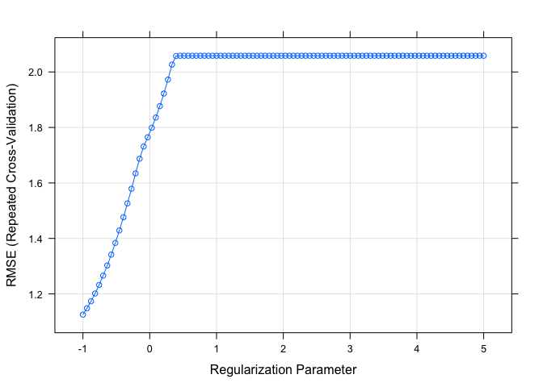

Data Science 2,Hw1
================
Ekta Chaudhary
24/02/2020

``` r
library(tidyverse)
library(caret)
library(ModelMetrics)
library(glmnet)
```

# Reading the Datasets

``` r
train_data = read_csv(file = "./data/solubility_train.csv")
test_data = read_csv(file = "./data/solubility_test.csv")
```

We will predict solubility of compounds using their chemical
structures.The training data are in the file “solubilitytrain.csv” and
the test data are in “solubil-itytest.csv”. Among the 228 predictors,
208 are binary variables that indicate the presenceor absence of a
particular chemical substructure, 16 are count features, such as the
numberof bonds or the number of bromine atoms, and 4 are continuous
features, such as molecularweight or surface area. The response is in
the column “Solubility”.

# Linear Model

``` r
fit_lm <- lm(Solubility~., data = train_data)
pred_lm <- predict(fit_lm, test_data)
mse(test_data$Solubility, pred_lm)
```

    ## [1] 0.5558898

``` r
x <- model.matrix(Solubility~.,test_data)[,-1]
# vector of response
y <- test_data$Solubility
ridge.mod <- glmnet(x,y, standardize = TRUE,
                    alpha = 0, 
                    lambda = exp(seq(-1, 10, length = 100)))
```

``` r
mat.coef <- coef(ridge.mod)
dim(mat.coef)
```

    ## [1] 229 100

``` r
set.seed(2)
cv.ridge <- cv.glmnet(x, y, type.measure = "mse",
                      alpha = 0, 
                      lambda = exp(seq(-1, 10, length = 100)))

plot(cv.ridge)
```

<!-- -->

``` r
best.lambda <- cv.ridge$lambda.min
best.lambda
```

    ## [1] 0.3678794

``` r
best.lambda <- cv.ridge$lambda.min
best.lambda
```

    ## [1] 0.3678794

``` r
cv.ridge
```

    ## 
    ## Call:  cv.glmnet(x = x, y = y, lambda = exp(seq(-1, 10, length = 100)),      type.measure = "mse", alpha = 0) 
    ## 
    ## Measure: Mean-Squared Error 
    ## 
    ##     Lambda Measure      SE Nonzero
    ## min 0.3679  0.6023 0.08116     228
    ## 1se 1.2488  0.6820 0.09665     228

``` r
predict(ridge.mod, s = best.lambda, type="coefficients")
```

    ## 229 x 1 sparse Matrix of class "dgCMatrix"
    ##                              1
    ## (Intercept)        5.962967086
    ## FP001              0.085649310
    ## FP002             -0.038141623
    ## FP003             -0.128894139
    ## FP004              0.028537683
    ## FP005             -0.079457993
    ## FP006              0.067875164
    ## FP007              0.018499263
    ## FP008             -0.038321281
    ## FP009             -0.003345371
    ## FP010              0.127789763
    ## FP011              0.056271415
    ## FP012             -0.070058483
    ## FP013             -0.073583070
    ## FP014             -0.103826166
    ## FP015              0.088744274
    ## FP016             -0.064339932
    ## FP017             -0.300879395
    ## FP018             -0.063807300
    ## FP019             -0.142621732
    ## FP020             -0.030826639
    ## FP021             -0.162350411
    ## FP022              0.173697579
    ## FP023              0.329095096
    ## FP024              0.178794554
    ## FP025             -0.046415629
    ## FP026              0.151577648
    ## FP027              0.057127264
    ## FP028              0.162867766
    ## FP029              0.064039740
    ## FP030              0.171768786
    ## FP031              0.236006734
    ## FP032              0.059262547
    ## FP033              0.109752720
    ## FP034             -0.108826919
    ## FP035              0.015649022
    ## FP036             -0.363772701
    ## FP037              0.049259150
    ## FP038              0.032478780
    ## FP039             -0.252260471
    ## FP040              0.108317315
    ## FP041             -0.121817505
    ## FP042              0.055815726
    ## FP043              0.368097262
    ## FP044             -0.628334694
    ## FP045              0.179682809
    ## FP046              0.070149471
    ## FP047             -0.058343191
    ## FP048             -0.118793084
    ## FP049              0.367443695
    ## FP050             -0.077322627
    ## FP051             -0.111498857
    ## FP052              0.047620326
    ## FP053             -0.203928029
    ## FP054             -0.362779179
    ## FP055              0.049778257
    ## FP056             -0.252416370
    ## FP057             -0.148631941
    ## FP058              0.170893309
    ## FP059             -0.428894313
    ## FP060             -0.035617504
    ## FP061             -0.069408444
    ## FP062              0.080046600
    ## FP063              0.181720707
    ## FP064              0.099526916
    ## FP065             -0.092565461
    ## FP066              0.030606533
    ## FP067              0.254716860
    ## FP068             -0.027678091
    ## FP069              0.035075472
    ## FP070             -0.302864515
    ## FP071             -0.034847738
    ## FP072              0.220188549
    ## FP073              0.119633727
    ## FP074              0.171842023
    ## FP075              0.049910824
    ## FP076             -0.126069583
    ## FP077              0.008738730
    ## FP078              0.136504906
    ## FP079              0.024426872
    ## FP080              0.115986716
    ## FP081             -0.102746851
    ## FP082             -0.003959824
    ## FP083             -0.190022873
    ## FP084              0.130818910
    ## FP085             -0.084294810
    ## FP086             -0.078303091
    ## FP087             -0.077429099
    ## FP088              0.168666901
    ## FP089             -0.170152825
    ## FP090              0.073021372
    ## FP091              0.078998202
    ## FP092              0.034521941
    ## FP093             -0.003699890
    ## FP094             -0.033926690
    ## FP095              0.028071195
    ## FP096              0.254344551
    ## FP097             -0.028176058
    ## FP098              0.034307434
    ## FP099              0.043307768
    ## FP100             -0.017591282
    ## FP101              0.262738882
    ## FP102              0.091993050
    ## FP103             -0.002444620
    ## FP104             -0.341278348
    ## FP105             -0.024308736
    ## FP106             -0.302237581
    ## FP107             -0.011122103
    ## FP108              0.003698995
    ## FP109             -0.198551597
    ## FP110             -0.062589275
    ## FP111             -0.173878562
    ## FP112             -0.097009065
    ## FP113              0.113283285
    ## FP114              0.069495731
    ## FP115              0.067237766
    ## FP116              0.075036117
    ## FP117              0.074104297
    ## FP118             -0.024846750
    ## FP119             -0.097538062
    ## FP120              0.079586166
    ## FP121              0.053578392
    ## FP122              0.098917950
    ## FP123              0.012429392
    ## FP124              0.143766014
    ## FP125              0.145728328
    ## FP126             -0.168087906
    ## FP127             -0.140601266
    ## FP128             -0.083438743
    ## FP129              0.045349260
    ## FP130              0.090851573
    ## FP131              0.341249368
    ## FP132              0.010872512
    ## FP133             -0.033780601
    ## FP134             -0.211133241
    ## FP135              0.066201425
    ## FP136              0.115069662
    ## FP137              0.039043805
    ## FP138             -0.183977227
    ## FP139              0.255977054
    ## FP140              0.095370335
    ## FP141             -0.051755927
    ## FP142              0.386637517
    ## FP143             -0.126703758
    ## FP144              0.143425891
    ## FP145              0.022704018
    ## FP146             -0.059808473
    ## FP147              0.060644311
    ## FP148             -0.138813683
    ## FP149             -0.139250533
    ## FP150              0.172830438
    ## FP151              0.292371864
    ## FP152             -0.155185585
    ## FP153             -0.063475454
    ## FP154             -0.729085476
    ## FP155             -0.192424263
    ## FP156             -0.114837625
    ## FP157             -0.080099219
    ## FP158             -0.189638417
    ## FP159              0.330817386
    ## FP160              0.102637485
    ## FP161             -0.072669300
    ## FP162              0.119500685
    ## FP163              0.197455553
    ## FP164             -0.021572165
    ## FP165             -0.059032623
    ## FP166              0.058507679
    ## FP167             -0.065750753
    ## FP168             -0.017303758
    ## FP169             -0.066719839
    ## FP170              0.292146405
    ## FP171              0.044386684
    ## FP172             -0.229566719
    ## FP173              0.111573349
    ## FP174              0.259972113
    ## FP175             -0.022721979
    ## FP176             -0.075324925
    ## FP177             -0.210633592
    ## FP178             -0.098350135
    ## FP179              0.282405081
    ## FP180             -0.059423423
    ## FP181              0.113424575
    ## FP182              0.031076193
    ## FP183             -0.007832784
    ## FP184              0.024679520
    ## FP185             -0.239940163
    ## FP186             -0.085080297
    ## FP187             -0.010841045
    ## FP188              0.046110607
    ## FP189              0.209449285
    ## FP190              0.088353441
    ## FP191             -0.067591135
    ## FP192             -0.153169087
    ## FP193             -0.011311128
    ## FP194             -0.063957144
    ## FP195              0.059058315
    ## FP196             -0.100062035
    ## FP197             -0.150595282
    ## FP198             -0.108876120
    ## FP199             -0.158637156
    ## FP200             -0.360867373
    ## FP201              0.724072472
    ## FP202              0.075433659
    ## FP203              0.167399063
    ## FP204              0.019506606
    ## FP205              0.268032442
    ## FP206             -0.259569888
    ## FP207             -0.012990696
    ## FP208              0.166689756
    ## MolWeight         -0.930391075
    ## NumAtoms          -0.317598765
    ## NumNonHAtoms      -0.494241347
    ## NumBonds          -0.285024725
    ## NumNonHBonds      -0.244069634
    ## NumMultBonds      -0.070668295
    ## NumRotBonds       -0.082331169
    ## NumDblBonds        0.046311395
    ## NumAromaticBonds  -0.077969321
    ## NumHydrogen        0.038189297
    ## NumCarbon         -0.184640843
    ## NumNitrogen        0.303639353
    ## NumOxygen          0.140357282
    ## NumSulfer         -0.517616240
    ## NumChlorine       -0.442420925
    ## NumHalogen        -0.208124142
    ## NumRings          -0.213784646
    ## HydrophilicFactor  0.134028916
    ## SurfaceArea1       0.051585909
    ## SurfaceArea2       0.038056624

``` r
# predict(cv.ridge, s = best.lambda, type="coefficients") 
# predict(cv.ridge, s = "lambda.min", type="coefficients") 
# predict(cv.ridge, s = "lambda.1se", type="coefficients") 
```
